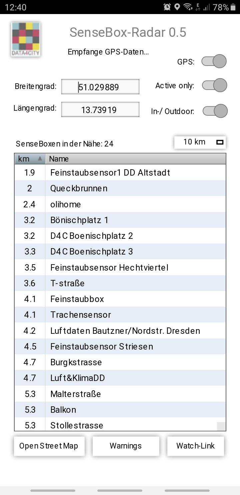

# Data4City_SenseBoxRadar
Eine Mobile-App, um die Daten von Senseboxen in der Nähe zu analysieren

* Auf einem Smartphone mit GPS wird der aktuelle Standort identifiziert, anhand der Einstellung (1-250 km) die umliegenden Senseboxen erkannt und in einer Liste sortiert nach Nähe angezeigt.
* Wenn man den Schalter "GPS" aus schaltet, können die GPS-Koordinaten auch manuell in die Felder eingetragen werden.
* Ein Update der Liste erfolgt immer, wenn der "XX km"-Button aktiviert wird.
* Filter sind "Indoor oder Outdoor-Boxen" und "Active only", dh. nur Boxen, deren Daten aktuell sind (nicht älter als zwei Stunden)
* beim Doppelklick auf einem Eintrag wird die entsprechende Seite der Box auf der Opensensemap geladen
* Der Button "Openstreetmap" lädt die Openstreetmap-Webpage, um einen anderen Ort auszuwählen, von dem man die Sensebox-Daten haben möchte. So kann man auch ohen dort zu sein, erfahren, wie die aktuellen Daten z.B. in Berlin sind
* Der Button "Warnings" lädt eine Seite, auf die Daten der angezeigten Boxen in gesundheitsrelevante Indizes konvertiert werden: Hitze-Index, UV-Index und Feinstaub-Werte.
* Der Button "Watch-Link" führt auf eine Seite, welche die grundlegenden Sensordaten der angezeigten Boxen darstellt: Temperatur, Feinstaub-Werte, Luftdruck, Luftfeuchtigkeit und Beleuchtungsstärke.

Die Datei ist ein Livecode-Stackfile, d.h. sie kann mit der Livecode-IDE geladen und editiert/ausgeführt werden. 
Download der Community-Version von Livecode hier: www.livecode.org

Um sie zu einer Android oder iOS-App zu verwandeln, muss vorher das Java-SDK bzw. XCode installiert und eingerichtet werden.
* http://lessons.livecode.com/m/2571/l/27385-how-do-i-become-an-android-developer-on-a-pc
* http://lessons.livecode.com/m/2571/l/23275-how-do-i-become-an-ios-developer
